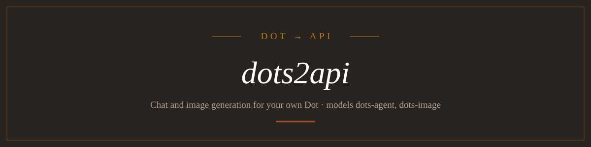

<p align="center">
  
</p>

<p align="center">
  <strong>Use your own OpenAI Dot through an OpenAI-compatible HTTP API on a personal server.</strong>
</p>

<p align="center">
  <a href="package.json"></a>
  <a href="install.sh"></a>
  <a href="LICENSE"></a>
</p>

<!-- README-I18N:START -->

**English** | [中文](./README.zh.md) | [한국어](./README.ko.md)

<!-- README-I18N:END -->

**[dots2api](https://github.com/yelixir-dev/dots2api)** ("Dot to API") is a personal gateway that exposes your own OpenAI **Dot** as chat completions (tool calls included) and image generation, with a web console for accounts, job history and generated images. It serves **`dots-agent`** (chat) and two image models: **`dots-image`** (your Dot) and **`muse-image`** (your own muse.ai account).

[What it does](#what-it-does) · [Install](#install) · [Usage](#usage) · [How it works](#how-it-works) · [Repository layout](#repository-layout) · [Current limitations](#current-limitations) · [License](#license)

## What it does

- **OpenAI-style chat.** `POST /v1/chat/completions` with `dots-agent`; `tools` and `tool_choice` work through a prompt-based JSON bridge, and the returned calls are executed by your client (for example OmO).
- **Image generation.** `POST /v1/images/generations` with `dots-image` or `muse-image` takes `prompt`, `n` (1–4), `size`, `quality` and `response_format` (`b64_json` or `url`); files are accepted as PNG, JPEG or WebP, judged by file signature and capped at 32 MiB each. `dots-image` runs on a Dot; `muse-image` generates through your own muse.ai account in an isolated Chrome profile (needs Node.js 22 or newer and Chromium) and usually returns WebP.
- **Provider and account switches.** Every account has its own enable switch, and each provider (Dots, Muse) has a master switch that stops new jobs from routing to it without touching stored credentials.
- **Self-healing.** A Dots account whose thread lost its agent rebinds to a fresh thread on its own; a Muse account whose session expired or whose cloud workspace VM slept renews the session and wakes the VM before running, so it recovers after a remote reset or a server reboot. When a job ends unconfirmed, the gateway re-checks that account's session before taking it out of rotation and keeps it usable if the check passes; a Muse job is retried once only after such a re-check, and the job text says so (the first attempt may still finish on Muse).
- **Web console.** A React console on loopback with accounts, jobs, a job drawer with image preview, and an API guide that shows your local API key and an OmO `models.json` example.
- **Device-code login.** You approve at `auth.openai.com/codex/device`, possibly from another computer; tokens stay on the server, encrypted with AES-256-GCM, and are refreshed 60 seconds before expiry.
- **One job per account, in order.** A second job for the same account is accepted as `queued` and starts when the current one finishes, so concurrent requests never share a Dot thread; an account held by an interactive login or check answers `409 account_busy`, a full queue answers `429 queue_full`, and a provider with no usable account answers `503`.
- **Loopback only.** The server binds `127.0.0.1` and the `/v1` endpoints require a Bearer API key.

## Install

Requires Linux with user systemd and Bun 1.3 or later. The installer needs no root, builds nothing, and installs runtime dependencies only.

```bash
git clone https://github.com/yelixir-dev/dots2api.git
cd dots2api
./install.sh --port 3010
```

The installer copies the program to `~/.local/share/dots2api/app`, keeps data in `~/.local/share/dots2api/data`, and enables a user service named `dots2api`. Re-running it updates the program and restarts the service without touching data. On a server that you do not stay logged in to, run `sudo loginctl enable-linger "$USER"` once so the service keeps running.

To run from the source checkout instead:

```bash
bun install
bun run start
```

Open `http://127.0.0.1:3010`. `PORT` and `DOTS2API_DATA_DIR` change the port and the data directory.

```bash
PORT=3011 DOTS2API_DATA_DIR=/absolute/path/to/dots2api-data bun run start
```

On a remote (headless) server, forward the port from your own computer and open `http://127.0.0.1:3010` there.

```bash
ssh -N -L 3010:127.0.0.1:3010 user@server
```

### Data

- `dots2api.sqlite`: account metadata, jobs and the local API key. An old `bot2api.sqlite` is moved to this name on first start, and its **Grok Bot accounts, jobs and images are deleted**; Muse and Dots data are kept.
- `master.key`: the credential encryption key. Keep it together with the database or the accounts cannot be restored.
- `images/`: generated images, with no automatic cleanup.
- `logs/muse-worker.log`: one credential-free line per Muse worker run (outcome, and a trimmed browser error tail on failure), capped at 256 KiB.
- Prompts, results and images can be sensitive; do not share the data directory or put it in Git.

## Usage

### Connect a Dot

1. In the console, open **Accounts → Add account**, enter a label and the **existing Dot** (open `https://chatgpt.com/dots`, open the Dot you want, and paste the address from the address bar, `https://chatgpt.com/dots/<ID>`; the bare ID also works), and press **Start**. This creates the account and starts the device login in one step.
2. Open the shown ChatGPT link (`auth.openai.com/codex/device`) and approve the one-time code. The browser may be on a different computer from the server. The console polls for the approval and finishes the connection by itself; no further click is needed.
3. dots2api never creates a thread and refuses to connect unless the thread reports `threadSource: aeon`. If you cancel before it connects, the half-created account is removed.

Tokens are never returned to the browser. If a refresh is revoked or its result is unknown, log in again. **Do not share the same refresh token with Codex CLI or anything else.** An existing account can still be logged in again from its **Login** button. The full contract is in [`src/dots-auth/README.md`](src/dots-auth/README.md).

### Connect a Muse account

Muse has no official OAuth app, so a Muse account is connected by signing into muse.ai and keeping that session. In the console, choose **Accounts → Add account → Muse** and enter a label; the remote browser below opens on its own. The cookie fields are kept only as an advanced fallback when editing an account.

- **Remote browser (default, works on a headless server).** Adding a Muse account starts it right away; for an existing account open **Login → 원격 브라우저 시작**. The server opens a real Chromium on a private virtual display (Xvfb) and streams it into the console, where you sign in with Google directly. Use **크게 보기** to fill the window with the remote screen, then press **로그인 완료 및 연결 확인** when done. The viewer runs on the console's own port, so no extra SSH tunnel is needed.
  On a fresh headless server (for example Oracle Cloud) install the two dependencies once, with root:
  ```bash
  sudo apt install -y xvfb        # Debian/Ubuntu; on Oracle Linux use: sudo dnf install -y xorg-x11-server-Xvfb
  bunx playwright install --with-deps chromium
  ```
  `--with-deps` pulls Chromium's shared libraries. If `Xvfb` is not on the service's `PATH`, set it (or install it under `/usr/bin`); the launcher looks it up with `Bun.which("Xvfb")`.
- **Cookie import.** Sign into muse.ai in your own browser, open DevTools → Network, pick a `muse.ai` request, and open the account's **Edit → 고급: 인증값 직접 입력**, paste its `Cookie` request header into **Cookie header** (or an exported cookie JSON into **Cookies JSON**), then **Save and check**.

Either way the renewed session cookies are written back to the account, and the Muse self-heal renews the session and wakes the workspace VM before every job.

Every `muse-image` job opens a new Muse thread, which the Muse app keeps as a side chat titled after the prompt. Set `DOTS2API_MUSE_PRUNE_THREADS=1` in the service environment to delete that side chat after a job succeeds. Deletion cannot be undone, so it is off by default; it only deletes the one row Muse marks as the open thread, and a failed or uncertain job leaves its side chat in place.

### Chat

Read your API key in the console under **API guide**, then:

```bash
export DOTS2API_KEY='the key shown in the console'
curl http://127.0.0.1:3010/v1/models -H "Authorization: Bearer $DOTS2API_KEY"
```

```bash
curl http://127.0.0.1:3010/v1/chat/completions \
  -H "Authorization: Bearer $DOTS2API_KEY" -H 'Content-Type: application/json' \
  -d '{"model":"dots-agent","messages":[{"role":"user","content":"Introduce yourself in one line."}]}'
```

- The working context budget is **272,000 tokens**. It is a designated value, not a measurement, and it appears as `context_window` in `/v1/models`. Count output, system instructions and tool definitions against it.
- Tool calls are a prompted JSON bridge, not a native tool API (`X-Dots2api-Tools: prompted`). `strict: true`, `response_format` and `/v1/responses` return 422. On 2026-10-04 this bridge completed the tool round trip 3 of 3 times, which is a small sample.
- `stream: true` sends the finished result once as SSE (`X-Dots2api-Streaming: buffered`). Token counts are unknown, so no `usage` is produced (`X-Dots2api-Usage: unknown`), and `max_tokens` is advisory.
- Every response carries `X-Dots2api-Job-Id`; look the job up with `GET /api/jobs/:id`.

### Image generation

```bash
curl -sS http://127.0.0.1:3010/v1/images/generations \
  -H "Authorization: Bearer $DOTS2API_KEY" -H 'Content-Type: application/json' \
  -d '{"prompt":"a silver sports car on a beach, photorealistic, golden hour","size":"1536x1024","quality":"high"}' \
  | jq -r '.data[0].b64_json' | base64 -d > out.png
```

- Request: `prompt` (required), `n` (1–4, default 1), `size` (`auto`, `1024x1024`, `1536x1024`, `1024x1536`), `quality` (`auto`, `low`, `medium`, `high`), `response_format` (`b64_json` default, or `url`). Any other field returns 400.
- Response: OpenAI-shaped `data[]` (`b64_json` or `url`, plus the `revised_prompt` the Dot actually used), `output_format: "png"` and the real `size`. A `url` points to `GET /api/jobs/:id/images/0` and **needs the API key**.
- One image takes about a minute, and `n` images are made one after another in the same Dot thread. If the last ones fail, the finished images are returned and the `X-Dots2api-Images-Requested` and `X-Dots2api-Images-Returned` headers say how many.
- Reference-image edits use `POST /v1/images/edits` with `dots-image` or `muse-image` and multipart uploads:

```bash
curl -sS http://127.0.0.1:3010/v1/images/edits \
  -H "Authorization: Bearer $DOTS2API_KEY" \
  -F model=dots-image -F 'image=@reference.png' \
  -F 'prompt=Keep the subject, replace the background with a beach' \
  -F response_format=b64_json
```

- Supply 1–8 PNG/JPEG/WebP files as `image` or `image[]`, with at most 32 MiB of image bytes in total (33 MiB multipart body limit). File signatures determine the type. Other options and the response match generations. With `dots-image` the reference bytes are sent as separate app-server image inputs, not prompt text; with `muse-image` they are uploaded through the Muse composer, and the prompt is sent only after the composer shows every reference as attached (a preview and a Remove control for each, and an enabled Send button). If that never happens the job fails with `muse_attachment` (502) before anything is sent, instead of editing without the reference. Reference bytes are not stored in job history.
- Masks, variations and JSON image URLs are not supported. Checked once against a real Dot on 2026-10-10: a reference with a red circle and a background-only instruction returned 200 in about 45 s with the circle kept and only the background changed. Checked once against a real Muse on 2026-10-10: a reference holding an off-centre red circle, a blue triangle and a black bar returned 200 in about 55 s with the circle and the bar kept within 3% of their centre and 4% of their size and only the background replaced.

### Jobs API

Send long work asynchronously with `POST /api/jobs {"provider":"dots","prompt":"..."}` and poll `GET /api/jobs/:id`. A job that arrives while its account is busy reports `status: "queued"` until its turn comes. `GET /api/events` streams a `change` event over SSE when connection state changes.

## How it works

1. A client calls `/v1/...` with the Bearer key, or the console calls `/api/...` from the same origin.
2. The gateway picks an enabled account that is not already running a job, and queues work for a busy account behind the job in flight.
3. The Dots provider opens `wss://codex-cloud-backend.chatgpt.com` and speaks the app-server JSON-RPC that the Codex client uses, on your existing Aeon thread.
4. The job and its state are persisted in SQLite.
5. Chat output is returned as OpenAI JSON or SSE; images are checked by file signature and saved under `images/<job id>/`.
6. A timeout or restart with an unknown remote outcome marks the job `unknown` and is never resent automatically.

## Repository layout

```text
src/providers/dots.ts  Dot connection, turns, image receipt
src/dots-auth/         device login and token refresh
src/gateway.ts         account choice, per-account concurrency, job state
src/store.ts           SQLite persistence and encryption
src/api.ts             HTTP endpoints (src/images-api.ts for images)
src/web/               React console (DESIGN.md is its design contract)
```

### Development

```bash
bun run dev
bun run typecheck
bun test
```

Tests use fixtures and never connect to a real Dot. Login, the tool round trip and image generation were checked separately with a real account on 2026-10-04, including opening more than 15 received PNG files, which does not guarantee later service changes or quota effects.

## Current limitations

- **Unofficial route.** Dots has no public model API. dots2api uses the app-server JSON-RPC of `wss://codex-cloud-backend.chatgpt.com` and sends `User-Agent` and `originator` headers that identify a Codex client. OpenAI can change or block this path, and terms or account restrictions are your risk to accept; if you cannot accept that, do not use it.
- **Personal use only.** It is built for your own Dot account or a few of them, with no user separation, rate limits or billing, and it is not a vault against processes that can read local files. Do not serve other people or resell an account.
- **Image settings are hints.** The Dot decides size and quality itself, so `size` and `quality` are only requested in words; observed sizes were 1254×1254 and 1536×1024. A text-only reply returns 502 (`image_not_generated`), and quota accounting for images is unverified, so check limits before generating in bulk.
- **No usage numbers.** Chat is buffered rather than streamed token by token and reports no `usage`; Dot chats are said not to count toward ChatGPT limits, but deep-work limits exist.

## License

MIT. See [LICENSE](LICENSE).

---

<p align="center"><em>dots2api — a personal gateway for your own Dot.</em></p>
